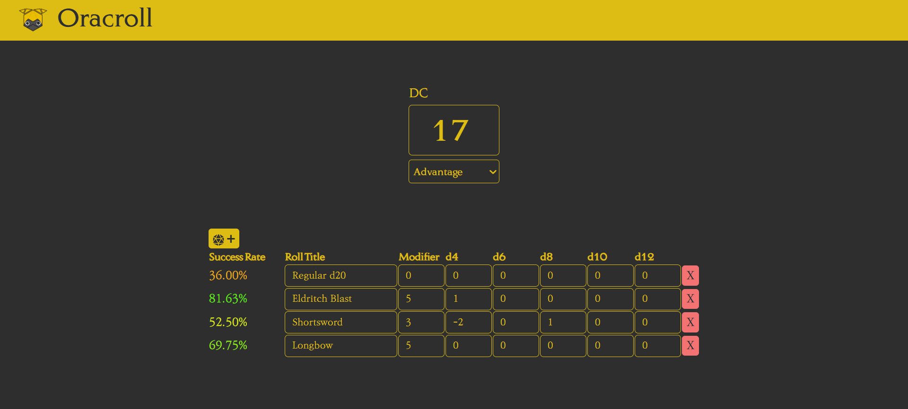
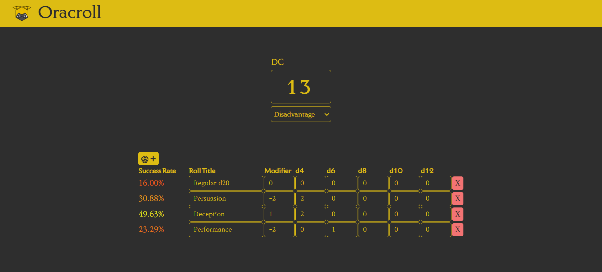

### Oracroll 1.0 ###
This is a little application that predicts the chances of success of a d20 against a difficulty class, given modifiers, advantage and additional die. Version 1.0 is represents the core functionality of this app (an MVP if you will), with the following main features:
* Difficulty class input + advantage state (advantage, straight roll, or disadvantage)
* Add/Remove different rolls
* Edit roll details, including title, modifier, and number of additional dices (d4, d6, d8, d10 and d12s, negative inputs mean subtracting die)
* Success rate display for each roll, given their details

### About ###
I created this application to help some mates with decision making in our D&D campaign. I was inspired by the combat system from Baldur's Gate 3, where chances of success are displayed everytime the player attempts an attack or spell. This was also a little project I made to refresh/sharpen my React skills. It could've been made with just regular Javascript, but honestly I've been having a ton of fun learning this framework and that's enough reason for me. 